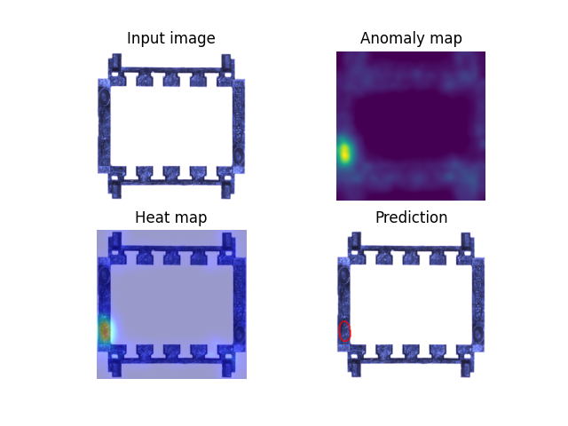
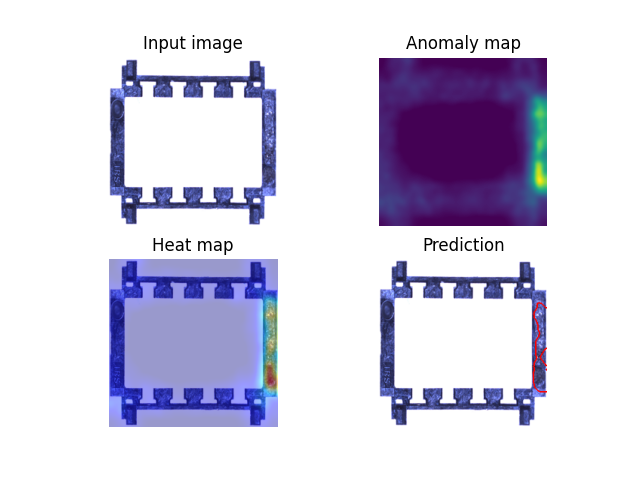
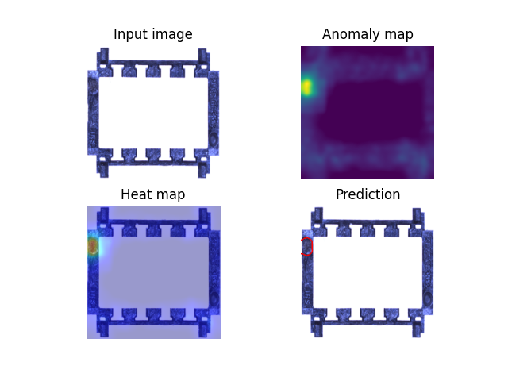

# SurfaceDefect

Identify surface defects of a given industrial product.

Because this is an out-of-distribution problem, unsupervised learning methods are used to overcome the limitations of supervised learning such as:

- Lack of labeled data in error case
- Data imbalance

Model PaDiM in Anomalib achieves 99% accuracy and speeds around 100 ms per image.

